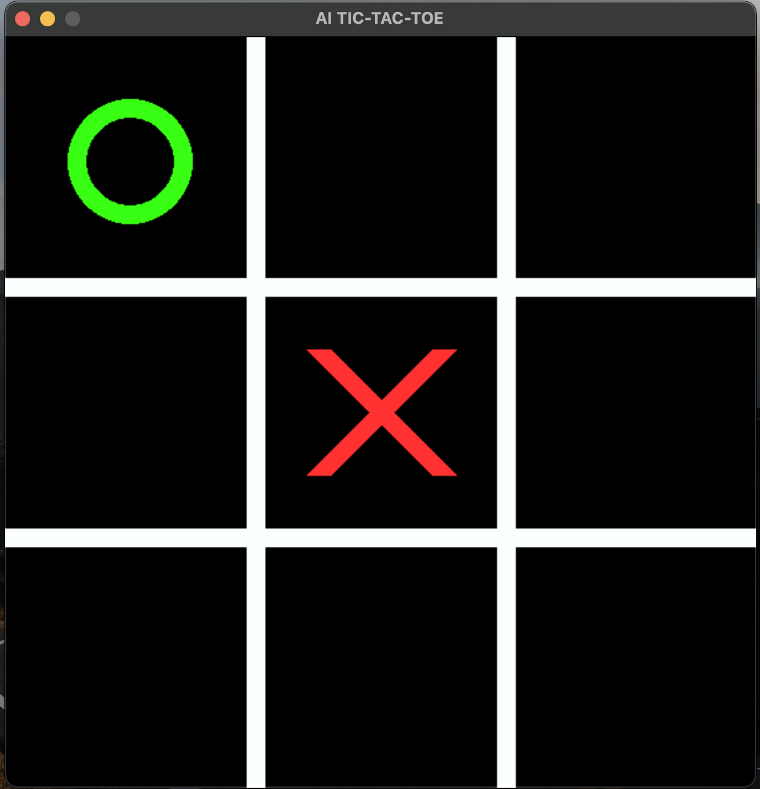

# UNBEATABLE AI TIC-TAC-TOE

A Python based Tic-Tac-Toe game that uses Minimax Algorithm to decide the next move. The best you can do is a draw ;)

There are 3 game modes: AI Minimax, Random AI, PvP

## Keyboard Commands

To change the gamemode between AI and PvP - use 'g' key.

To change between Random AI and Minimax AI: 

Use '1' to switch to Minimax Algorithm.

Use '0' to switch to Random Algorithm.
    
## Screenshots

